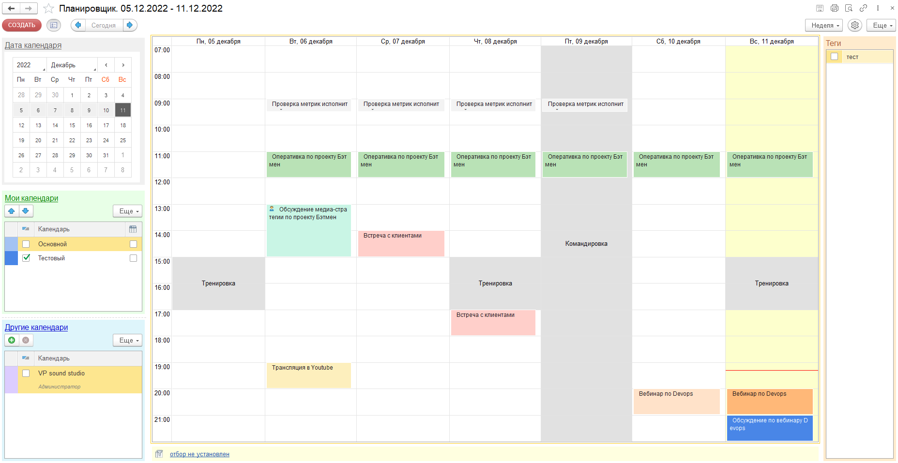

# Внешний вид
{: .no_toc }

  

    Содержание
  

  {: .text-delta }
1. TOC
{:toc}

Основная страница “Планировщика” выглядит следующим образом:

Обратите внимание, на картинке, страница поделена несколько частей:

- командная панель планировщика (верх формы)
- панель управления периодом и календарями  (левая часть)
- основное окно планировщика (центральная часть)
- панель отбора по тегам (правая часть)
- панель настройки отбора событий (низ формы)

## Командная панель

Командная панель формы содержит набор необходимых команд для работы

### Левая часть командной панели

- **Создать** - открывает создание нового события. По умолчанию событие будет установлено на текущую дату и ближайшее время. Календарь используется основной.

- Следом за кнопкой “**Создать**” находится  кнопка управления видимостью панели периода и календарей

- Далее располагаются кнопки переключения периодов (стрелки влево и вправо), а также кнопка быстрого возврата в текущую дату “**Сегодня**”

### Правая часть командной панели:

- Подменю переключения внешнего вида: **День**, **Неделя**, **Месяц**, **Расписание**, **Год**, **Повестка**, **Доска**

- После кнопки переключения внешнего вида, кнопка быстрого доступа к настройкам пользователя

- Завершает командную панель подменю **“Еще”**, в котором расположены следующие команды:

  - Рабочее время - переключение отображения часов рабочего времени

  - Нерабочие периоды - переход к списку нерабочих периодов пользователя

  - Теги - управление видимостью панели тегов событий календаря

  - Мои календари - переход к списку всех календарей пользователя

  - Мои настройки - кнопка перехода к форме настройки календаря

  - Обновить (F5) - полное обновление данных и внешнего вида формы

  - Печать - печать формы планировщика

  - Просмотр - предварительный просмотр

## Панель периода и календарей

Панель периода и календарей содержит блоки “Дата календаря”, “Мои календари” и “Другие календари”.

**Дата календаря** позволяет быстро переключаться на другую дату. При этом внешний вид не будет изменен, т.е. будут пересчитаны события и отображен новый период.

**Мои календари** отображает календари, которые пользователь создал самостоятельно или загрузил из списка Google. В списке можно отключать видимость календарей (флажок слева от названия) или включить календарь в группировку (флажок справа от названия).

**Другие календари** отображает все календари, на которые пользователь подписался. Подписка может быть оформлена на общедоступные календари или календари, для которых создатель предоставил доступ на чтение и/или изменение. Если для пользователя есть календари, на которые можно подписаться, будет выведено сообщение в основном окне. Для подписки на календарь, необходимо нажать кнопку со знаком “+” (добавить) в командной панели над табличной частью.

В обеих табличных частях календарей, можно управлять порядком расположения календарей в списке. Для этого присутствуют кнопки перемещения вниз и вверх (в командной панели над табличными частями).

## Панель настройки отборов

В нижней части расположена панель настройки отборов событий. Зачем она нужна?

Обычно, если начинать активно пользоваться календарем, со временем количество событий в нем становится очень большим. Тут и личные события и рабочие, возможно какие то события связанные с непосредственными текущими задачами. В результате, когда ваше расписание будет максимально нагромождено, читать его будет крайне сложно. При это деление на календари не всегда удобно.

Тут на помощь приходит возможность настроить отбор. Например: события с определенными статусами, содержащие специальные слова. Таким образом, в расписании останутся только отобранные события.

Данная возможность является эксклюзивом нашего решения.