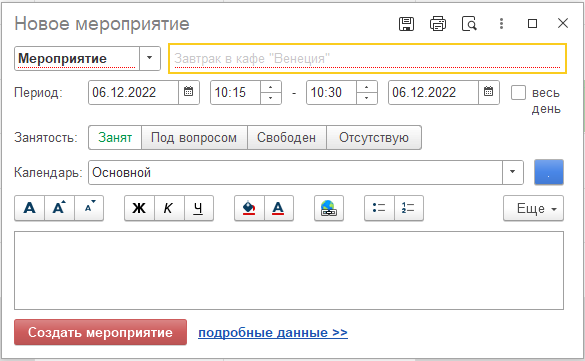
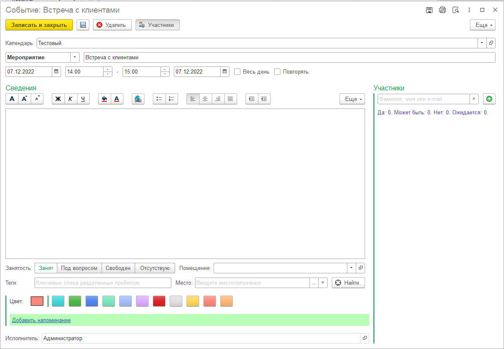

# Редактирование событий

Событие в планировщике может быть создано несколькими способами:

- в форме отображения планировщика можно выделить временной диапазон и программа откроет форму быстрого создания события;
- нажатием кнопки "Создать" на форме планировщика, при этом отобразится расширенная форма редактирования события.

## Форма быстрого редактирования

На форме быстрого редактирования можно ввести следующие данные:
- наименование мероприятия;
- время проведения (с возможностью изменения периода, времени);
- календарь + цвет события;
- статус занятости.

При необходимости более детального редактирования (например задать повторение, место проведения, пригласить участников) необходимо нажать гиперссылку "**Подробные данные**".

## Расширенная форма редактирования

В расширенной форме, помимо реквизитов быстрого ввода можно ввести следующую информацию:
- настройку повторений;
- описание события;
- место проведения;
- задать напоминания;
- указать участников события (обязательные/нет, с уведомлением/нет).

При этом, можно настроить дополнительные реквизиты и свойства к каждому событию (например Помещение). Дополнительные свойства и реквизиты добавляются при помощи подсистемы БСП "Дополнительные реквизиты и свойства".

Так же, событие может быть связано с любым объектом конфигурации (элемент справочника, документ), в таком случае в области данных “**Сведения**”, будет отображена гиперссылка на связанный объект данных.

