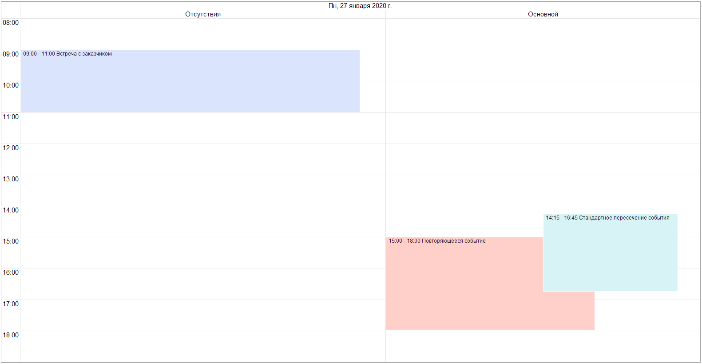

# Группировка событий

Для всех видов планировщика, кроме “**Повестка**” возможно установить группировку по собственным календарям.

В будущем мы планируем расширить возможности группировки, а именно:

- добавить группировки по другим свойствам событий (статус, исполнитель, место и др.)
- добавить возможность настройки вложенных группировок
- добавить возможность управлять расположением группировки для вида “Расписание” (слева, сверху, снизу, справа)
- добавить группировки в вид “Повестка” с отображением в виде дерева