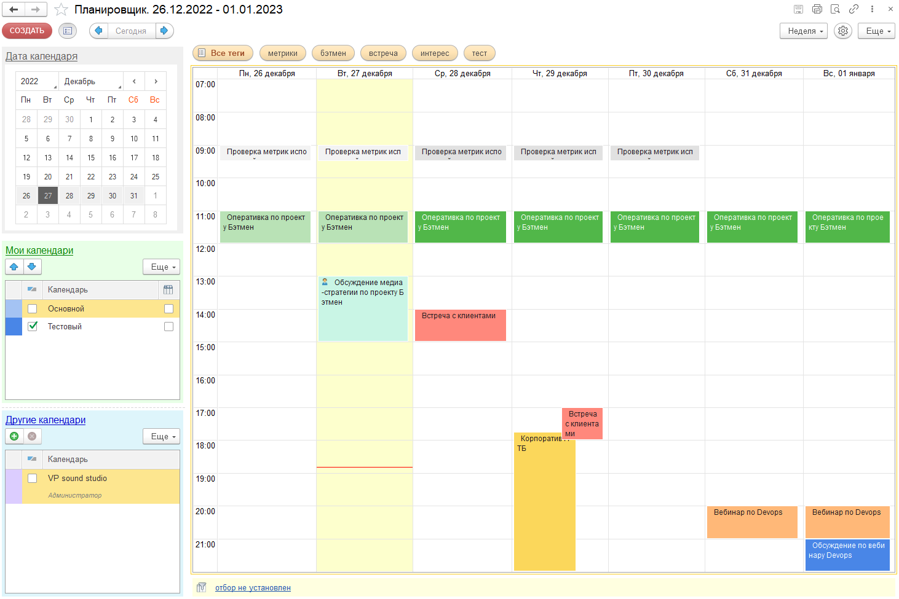

# Внешний вид

Основная страница “Планировщика” выглядит следующим образом:

Обратите внимание, на картинке, страница поделена несколько частей:

- командная панель планировщика (верх формы)
- панель управления периодом и календарями  (левая часть)
- основное окно планировщика (центральная часть)
- панель отбора по тегам (правая часть)
- панель настройки отбора событий (низ формы)