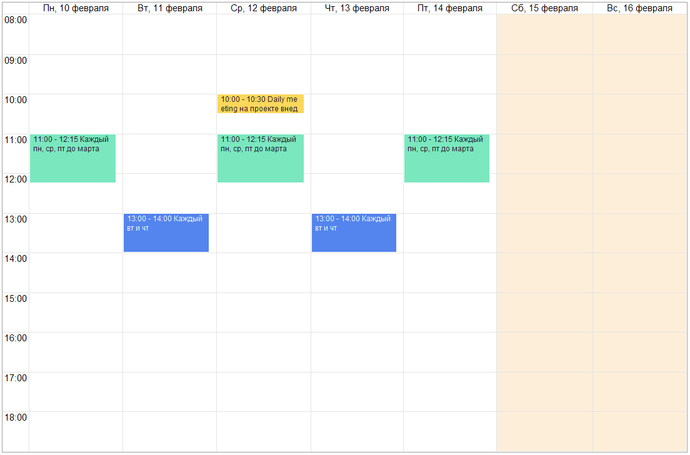

# Повторение событий

Любое созданное событие может быть настроено на повторения. При этом каждый экземпляр событий может быть изменен, отменен или перенесен на другое время (дату).

| Месяц | Неделя| Повестка дня |
|:---|:---|:---|
|  |  |  |

## Настройка повторения

Настройка повторений выполняется из расширенной формы редактирования следующим образом:

- выбирается режим повторения из следующих вариантов:
  - каждый день
    - с указанием интервала в количестве дней
  - каждый будний день (с пн по пт)
  - каждый пн, ср и пт
  - каждый вт и чт
  - каждую неделю
    - с указанием интервала в количестве недель
    - с указанием дней недели (пн, вт, ср, чт, пт, сб, вс)
  - каждый месяц
    - с указанием интервала в количестве месяцев
    - с выбором дней повторения: день месяца или день недели
  - каждый год
    - с указанием интервала в количестве лет
- устанавливается начало периода повторений (по умолчанию дата первого экземпляра)
- устанавливается вариант окончания повторений
  - никогда (по факту  +100 лет с момента начала)
  - после N количества повторений
  - до определенной даты

Как видите, настройка повторений максимально гибкая и позволяет быстро и понятно настроить практически любой шаблон повторений событий.